# [Tansoftware](https://www.tansoftware.com) - Mathématiques pour la programmation de jeux vidéo [](https://raw.githubusercontent.com/gosquared/flags/master/flags/flags/shiny/24/France.png)  [^1]

> /!\ En cours de réalisation : Des descriptions plus étoffées et détaillées, ainsi que des visuels, seront ajoutés prochainement. /!\

## Table des matières

1. [Introduction](#introduction)
2. [Bases des mathématiques](#bases-des-mathématiques)
   - [Coordonnées cartésiennes](#coordonnées-cartésiennes)
   - [Vecteurs](#vecteurs)
      - [Addition et soustraction de vecteurs](#addition-et-soustraction-de-vecteurs)
      - [Multiplication par un scalaire](#multiplication-par-un-scalaire)
      - [Produit scalaire](#produit-scalaire)
      - [Produit vectoriel](#produit-vectoriel)
   - [Matrices](#matrices)
     - [Addition et soustraction de matrices](#addition-et-soustraction-de-matrices)
     - [Multiplication par un scalaire](#multiplication-par-un-scalaire)
     - [Produit scalaire](#produit-scalaire)
     - [Produit vectoriel](#produit-vectoriel)
   - [Transformations](#transformations)
     - [Translation](#translation)
     - [Rotation](#rotation)
     - [Mise à l'échelle](#mise-à-léchelle)
     - [L'homothétie](#lhomothétie)
     - [Le cisaillement](#le-cisaillement)
   - [Géométrie linéaire](#géométrie-linéaire)
     - [Projection](#projection)
     - [Transformation de vue](#transformation-de-vue)
     - [Perspective](#perspective)
3. [Graphiques informatiques](#graphiques-informatiques)
   - [Graphiques vectoriels et bitmap](#graphiques-vectoriels-et-bitmap)
   - [Résolution et profondeur de couleur](#résolution-et-profondeur-de-couleur)
   - [Formats de fichier d'image](#formats-de-fichier-dimage)
4. [Éclairage et ombres](#éclairage-et-ombres)
   - [Sources de lumière](#sources-de-lumière)
   - [Modèles d'éclairage](#modèles-déclairage)
   - [Ombres](#ombres)
5. [Texture et mappage UV](#texture-et-mappage-uv)
   - [Texture et coordonnées de texture](#texture-et-coordonnées-de-texture)
   - [Mappage UV](#mappage-uv)
6. [Animation](#animation)
   - [Animation par squelette](#animation-par-squelette)
   - [Animation de forme](#animation-de-forme)
   - [Cinématique inverse](#cinématique-inverse)
7. [Physique des jeux](#physique-des-jeux)
   - [Simulation physique](#simulation-physique)
   - [Collision](#collision)
   - [Détection de collision](#détection-de-collision)
   - [Résolution de collision](#résolution-de-collision)
8. [Intelligence artificielle](#intelligence-artificielle)
   - [Comportement de base](#comportement-de-base)
   - [Navigation](#navigation)
   - [Apprentissage automatique](#apprentissage-automatique)
9. [Réseau et multijoueur](#réseau-et-multijoueur)
   - [Modèles de réseau](#modèles-de-réseau)
   - [Protocoles de communication](#protocoles-de-communication)
   - [Programmation de jeu multijoueur](#programmation-de-jeu-multijoueur)
10. [Techniques avancées](#techniques-avancées)
    - [Physique des fluides](#physique-des-fluides)
    - [Écrans multiples et fenêtrage](#écrans-multiples-et-fenêtrage)
    - [Intelligence artificielle avancée](#intelligence-artificielle-avancée)
    - [Rendu avancé](#rendu-avancé)
11. [Pipeline de rendu](#pipeline-de-rendu)
	- [Culling et occlusion](#culling-et-occlusion)
	- [Shaders](#shaders)


## Introduction

> **Avant toute chose**, si vous n'êtes pas familiarisé avec les formules ou notions mathématiques présentées ici, nous vous conseillons d'aller consacrer le temps nécessaire pour monter en compétences dans le domaine des mathématiques et de la physique, sur le site [Khan Academy](https://fr.khanacademy.org/).

Ce dépôt est conçu pour vous fournir une compréhension approfondie des concepts mathématiques et des techniques utilisées dans la programmation de jeux 3D et les graphiques informatiques.

Nous allons couvrir une variété de sujets allant des bases des mathématiques aux transformations géométriques, en passant par l'éclairage et la couleur, les projections et le rendu 3D, les techniques d'optimisation et la physique, ainsi que la simulation.

Vous apprendrez comment appliquer les concepts mathématiques pour résoudre des problèmes liés à la géométrie, aux transformations, à l'éclairage et au rendu, ainsi qu'à la gestion des performances et de la physique du jeu.

Que vous soyez un développeur de jeux vidéo expérimenté ou que vous vous lanciez tout juste dans le domaine, nous espérons qu'il vous aidera à renforcer vos connaissances en mathématiques et à améliorer vos compétences en programmation de jeux 3D et en graphiques informatiques.

[🔝 Retour en haut de page](#table-des-matières)

## Bases des mathématiques

Dans cette section, nous explorerons les concepts fondamentaux des mathématiques nécessaires pour la programmation de jeux 3D et les graphiques informatiques. Nous aborderons les coordonnées cartésiennes, les vecteurs, les matrices et les transformations.

___
### Coordonnées cartésiennes

Les coordonnées cartésiennes sont un système de coordonnées permettant de représenter les points dans l'espace à l'aide de nombres réels. 

> Les nombres **réels** sont une extension des nombres rationnels qui permettent de représenter toutes les grandeurs physiques, y compris les nombres irrationnels tels que $\pi$ et $\sqrt{2}$.  <br>


Dans un espace à deux dimensions (2D), un point est représenté par une paire de coordonnées (x, y).
Dans un espace à trois dimensions (3D), un point est représenté par un triplet de coordonnées (x, y, z).

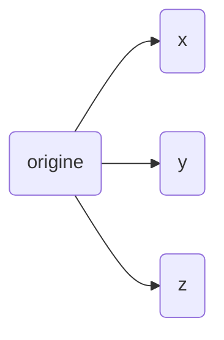

Fondamentales dans le domaine des jeux vidéo, en particulier pour les jeux en 3 dimensions, elles permettent de représenter et de manipuler les positions, les mouvements et les orientations des objets dans l'espace virtuel.
___
### Vecteurs

Les vecteurs sont des entités mathématiques représentant à la fois une magnitude (longueur) et une direction et sont généralement utilisés pour décrire la position, la vitesse, l'accélération et d'autres propriétés dans l'espace 2 ou 3D, dans un espace carthésien (dans un jeu vidéo, on privilégiera un type particulier de repère cartésien qu'est le repère orthonormé).

Son format d'écriture usuel s'exprime par 
```math
V = 
\begin{pmatrix}
v_1 \\
v_2 \\
\vdots \\
v_n
\end{pmatrix}
```

où chaque **v_i** est un **composant** du vecteur **V** (tel que v_1 est le premier composant, v_2 est le deuxième composant, et ainsi de suite), et la matrice représente un vecteur avec n composants, disposés verticalement en une seule colonne.

> Dans le contexte des vecteurs, un composant est un élément constitutif du vecteur qui indique sa valeur le long d'un axe particulier. Un vecteur est défini par un ensemble de composants, qui ensemble déterminent sa direction et sa magnitude.
>
> Par exemple, un vecteur à deux dimensions a donc deux composants (v_1 et v_2) qui représentent respectivement sa valeur le long des axes x et y. De même, un vecteur à trois dimensions a trois composants (v_1, v_2 et v_3), qui correspondent à sa valeur le long des axes x, y et z.
> 
> Les composants d'un vecteur permettent de décrire sa position ou sa direction dans un espace à n dimensions, où n est le nombre de composants du vecteur.

#### Une représentation possible en C# serait la suivante
```C#
using TansoftwareEngine;

public class Game : GameEngine
{
    void Start()
    {
        Vector3 position = new Vector3(1.0f, 2.0f, 3.0f);
	Player myPlayer = new Player();

        myPlayer.setPosition(position);
    }
}
```

*Ici, la classe Game, instancierait une position étant un vecteur de dimension 3, et serait affecté à Player, cette position en x (1.0f), y (2.0f), z (3.0f).*

L'avantage d'utiliser des vecteurs, plutôt que des nombres concrets, tient aux propriétés mathématiques associées, qui permettent une représentation plus flexible et une manipulation aisée des quantités géométriques dans les jeux vidéo et d'autres applications. 

En outre, les opérations vectorielles standard, telles que l'addition, la soustraction et la multiplication par un scalaire, simplifient les calculs et les transformations géométriques requises dans de nombreux scénarios. 

#### Addition et soustraction de vecteurs

Pour additionner ou soustraire deux vecteurs, il faut additionner ou de soustraire les composantes correspondantes de chaque vecteur :

-   Addition : **u** + **v** = (u_x + v_x, u_y + v_y, u_z + v_z)
-   Soustraction : **u** - **v** = (u_x - v_x, u_y - v_y, u_z - v_z)

#### Multiplication par un scalaire

> Un scalaire, est la représentation d'une quantité, sans direction.

Pour multiplier un vecteur par un scalaire, l'opération consiste à multiplier chaque composante du vecteur par le scalaire :

-   Multiplication par un scalaire : a * **v** = (a * v_x, a * v_y, a * v_z)

#### Produit scalaire

Le produit scalaire, également appelé produit intérieur, est une opération qui prend deux vecteurs et renvoie un nombre réel (scalaire). Il est défini comme suit :

-   Produit scalaire : **u** · **v** = u_x * v_x + u_y * v_y + u_z * v_z

#### Produit vectoriel

Le produit vectoriel, également appelé produit extérieur, est une opération qui prend deux vecteurs et renvoie un nouveau vecteur perpendiculaire à ces deux vecteurs. Il est défini comme suit :

-   Produit vectoriel : **u** × **v** = (u_y * v_z - u_z * v_y, u_z * v_x - u_x * v_z, u_x * v_y - u_y * v_x)

___
### Matrices

Les matrices sont des tableaux rectangulaires de nombres, utilisées pour effectuer des transformations linéaires sur des vecteurs. 

Elles sont couramment utilisées pour représenter des transformations géométriques telles que la translation, la rotation, la mise à l'échelle, ..., que nous verrons par la suite.

Une matrice est généralement représentée sous la forme d'un tableau avec M lignes et N colonnes. Les éléments d'une matrice sont généralement représentés en utilisant des lettres majuscules, telles que A, B, C, etc.

Les opérations courantes sur les matrices incluent l'addition, la soustraction, la multiplication par un scalaire et la multiplication de matrices.

> Il convient toutefois de différencier les matrices par leur représentation mathématique et informatique. <br>
> En mathématiques, elles sont utilisées pour représenter des transformations linéaires, résoudre des systèmes d'équations linéaires et effectuer des opérations sur des vecteurs, tandis que les matrices en informatique sont utilisées pour stocker et manipuler des données sous forme de tableaux à deux dimensions, pour des applications telles que les graphiques, l'apprentissage automatique, la modélisation de données et la simulation.

#### Addition et soustraction de matrices

Pour additionner ou soustraire deux matrices, il convient d'additionner ou de soustraire les éléments correspondants de chaque matrice :

-   Addition : A + B = [ a_ij + b_ij ]
-   Soustraction : A - B = [ a_ij - b_ij ]

#### Multiplication par un scalaire

Pour multiplier une matrice par un scalaire, il suffit de multiplier chaque élément de la matrice par le scalaire :

-   Multiplication par un scalaire : a * A = [ a * a_ij ]

#### Multiplication de matrices

La multiplication de matrices est une opération qui prend deux matrices et renvoie une nouvelle matrice. La multiplication de matrices est définie de telle manière que si A est une matrice de taille m x n et B est une matrice de taille n x p, alors le produit AB est une matrice de taille m x p.

La multiplication de matrices est généralement effectuée en multipliant les éléments de chaque ligne de la première matrice par les éléments correspondants de chaque colonne de la deuxième matrice, puis en additionnant les résultats.

-   Multiplication de matrices : AB = [ c_ij ] où c_ij = sum(a_ik * b_kj) pour k allant de 1 à n

### Transformations

Une transformation en mathématiques est une fonction qui associe à chaque élément d'un ensemble un autre élément du même ensemble.

Plusieurs types d'opérations s'appliquent dessus, tels que

#### Translation

La translation est une transformation qui déplace un objet d'une position à une autre sans changer sa forme ou son orientation. En 3D, elle peut être représentée par une matrice de transformation homogène 4x4 de la forme :

```math
\begin{pmatrix} 1 & 0 & 0 & t_x \\ 0 & 1 & 0 & t_y \\ 0 & 0 & 1 & t_z \\ 0 & 0 & 0 & 1 \end{pmatrix}
```

où $t_x$, $t_y$ et $t_z$ sont les quantités de mouvement dans chaque direction. 

Cette matrice peut être utilisée pour déplacer un vecteur de position homogène 
```math
\mathbf{v}_h = \begin{pmatrix} x \\ y \\ z \\ 1 \end{pmatrix}
```
d'une quantité de mouvement spécifique dans chaque direction. 

La multiplication de la matrice de translation homogène par le vecteur de position homogène produit un nouveau vecteur de position homogène :

```math
\mathbf{v}'_h = \begin{pmatrix} 1 & 0 & 0 & t_x \\ 0 & 1 & 0 & t_y \\ 0 & 0 & 1 & t_z \\ 0 & 0 & 0 & 1 \end{pmatrix} \begin{pmatrix} x \\ y \\ z \\ 1 \end{pmatrix} = \begin{pmatrix} x + t_x \\ y + t_y \\ z + t_z \\ 1 \end{pmatrix}
```

#### Rotation
La rotation en 3D est une transformation qui fait tourner un objet autour d'un point ou d'un axe donné, sans changer sa position ou sa taille. En 3D, elle peut être représentée par une matrice de transformation homogène 4x4 de la forme :

```math
\begin{pmatrix} r_{11} & r_{12} & r_{13} & 0 \\ r_{21} & r_{22} & r_{23} & 0 \\ r_{31} & r_{32} & r_{33} & 0 \\ 0 & 0 & 0 & 1 \end{pmatrix}
```

où 
```math
r_{11}, r_{12}, r_{13}, r_{21}, r_{22}, r_{23}, r_{31}, r_{32} et r_{33}
```
sont les coefficients de la matrice de rotation. 

Ces coefficients peuvent être calculés à partir des angles de rotation autour de chacun des axes X, Y et Z, ou à partir d'un vecteur d'axe de rotation et d'un angle de rotation.

Cette matrice peut être utilisée pour faire tourner un vecteur de position homogène 
```math
\mathbf{v}_h = \begin{pmatrix} x \\ y \\ z \\ 1 \end{pmatrix}
```
autour d'un point ou d'un axe de rotation donné. 

La multiplication de la matrice de rotation homogène par le vecteur de position homogène produit un nouveau vecteur de position homogène :

```math
\mathbf{v}'_h = \begin{pmatrix} r_{11} & r_{12} & r_{13} & 0 \\ r_{21} & r_{22} & r_{23} & 0 \\ r_{31} & r_{32} & r_{33} & 0 \\ 0 & 0 & 0 & 1 \end{pmatrix} \begin{pmatrix} x \\ y \\ z \\ 1 \end{pmatrix} = \begin{pmatrix} r_{11} x + r_{12} y + r_{13} z \\ r_{21} x + r_{22} y + r_{23} z \\ r_{31} x + r_{32} y + r_{33} z \\ 1 \end{pmatrix}
```


#### Mise à l'échelle
La mise à l'échelle est une transformation qui agrandit ou rétrécit un objet en le multipliant par un facteur de mise à l'échelle, sans changer sa position. 

En 2D, elle peut être représentée par une matrice de transformation homogène 3x3 de la forme :

```math
\begin{pmatrix} s_x & 0 & 0 \\ 0 & s_y & 0 \\ 0 & 0 & 1 \end{pmatrix}
```

où $s_x$ et $s_y$ sont les facteurs de mise à l'échelle selon les axes X et Y respectivement. 

Si $s_x$ et $s_y$ sont supérieurs à 1, la mise à l'échelle agrandit l'objet, tandis que s'ils sont inférieurs à 1, elle le rétrécit. Si $s_x$ et $s_y$ sont négatifs, la mise à l'échelle reflète l'objet par rapport à l'axe correspondant.

En 3D, la mise à l'échelle peut être représentée par une matrice de transformation homogène 4x4 de la forme :

```math
\begin{pmatrix} s_x & 0 & 0 & 0 \\ 0 & s_y & 0 & 0 \\ 0 & 0 & s_z & 0 \\ 0 & 0 & 0 & 1 \end{pmatrix}
```

où $s_x$, $s_y$ et $s_z$ sont les facteurs de mise à l'échelle selon les axes X, Y et Z respectivement.

Ces matrices peuvent être utilisées pour mettre à l'échelle un vecteur de position homogène 
```math
\mathbf{v}_h = \begin{pmatrix} x \\ y \\ z \\ 1 \end{pmatrix}
```
selon les facteurs de mise à l'échelle donnés. 

La multiplication de la matrice de mise à l'échelle homogène par le vecteur de position homogène produit un nouveau vecteur de position homogène :

En 2D :
```math
\mathbf{v}'_h = \begin{pmatrix} s_x & 0 & 0 \\ 0 & s_y & 0 \\ 0 & 0 & 1 \end{pmatrix} \begin{pmatrix} x \\ y \\ 1 \end{pmatrix} = \begin{pmatrix} s_x x \\ s_y y \\ 1 \end{pmatrix}
```
En 3D :
```math
\mathbf{v}'_h = \begin{pmatrix} s_x & 0 & 0 & 0 \\ 0 & s_y & 0 & 0 \\ 0 & 0 & s_z & 0 \\ 0 & 0 & 0 & 1 \end{pmatrix} \begin{pmatrix} x \\ y \\ z \\ 1 \end{pmatrix} = \begin{pmatrix} s_x x \\ s_y y \\ s_z z \\ 1 \end{pmatrix}
```

___
#### L'homothétie
L'homothétie est une transformation qui consiste à agrandir ou réduire un objet en multipliant toutes les distances entre ses points par un facteur d'échelle. 

Elle est similaire à la mise à l'échelle, mais ne maintient pas la position relative des points de l'objet.

En 2D, l'homothétie peut être représentée par une matrice de transformation homogène 3x3 de la forme :
```math
\begin{pmatrix} s & 0 & 0 \\ 0 & s & 0 \\ 0 & 0 & 1 \end{pmatrix}
```

où $s$ est le facteur d'échelle. Si $s$ est supérieur à 1, l'homothétie agrandit l'objet, tandis que s'il est inférieur à 1, elle le réduit. Si $s$ est négatif, l'homothétie inverse l'objet.

En 3D, l'homothétie peut être représentée par une matrice de transformation homogène 4x4 de la forme :
```math
\begin{pmatrix} s & 0 & 0 & 0 \\ 0 & s & 0 & 0 \\ 0 & 0 & s & 0 \\ 0 & 0 & 0 & 1 \end{pmatrix}
```
où $s$ est le facteur d'échelle.

Ces matrices peuvent être utilisées pour appliquer une homothétie à un vecteur de position homogène 
```math
\mathbf{v}_h = \begin{pmatrix} x \\ y \\ z \\ 1 \end{pmatrix}
```
en multipliant les coordonnées $x$, $y$ et $z$ par le facteur d'échelle $s$. La multiplication de la matrice de transformation homogène par le vecteur de position homogène produit un nouveau vecteur de position homogène :

En 2D :
```math
\mathbf{v}'_h = \begin{pmatrix} s & 0 & 0 \\ 0 & s & 0 \\ 0 & 0 & 1 \end{pmatrix} \begin{pmatrix} x \\ y \\ 1 \end{pmatrix} = \begin{pmatrix} s x \\ s y \\ 1 \end{pmatrix}
```
En 3D :
```math
\mathbf{v}'_h = \begin{pmatrix} s & 0 & 0 & 0 \\ 0 & s & 0 & 0 \\ 0 & 0 & s & 0 \\ 0 & 0 & 0 & 1 \end{pmatrix} \begin{pmatrix} x \\ y \\ z \\ 1 \end{pmatrix} = \begin{pmatrix} s x \\ s y \\ s z \\ 1 \end{pmatrix}
```

#### Le cisaillement
Le cisaillement est une transformation géométrique qui déforme un objet en le poussant le long d'un axe parallèle à un autre axe. Il peut être considéré comme une combinaison de translations et d'étirements.

En 2D, le cisaillement peut être représenté par une matrice de transformation homogène 3x3 de la forme :
```math
\begin{pmatrix} 1 & a & 0 \\ 0 & 1 & 0 \\ 0 & 0 & 1 \end{pmatrix}
```
où $a$ est le coefficient de cisaillement. Le coefficient $a$ détermine la quantité de déplacement du vecteur dans la direction de l'axe des $x$, par rapport à sa position d'origine, en fonction de sa coordonnée sur l'axe des $y$.

En 3D, le cisaillement peut être représenté par une matrice de transformation homogène 4x4 de la forme :
```math
\begin{pmatrix} 1 & a_{xy} & a_{xz} & 0 \\ a_{yx} & 1 & a_{yz} & 0 \\ a_{zx} & a_{zy} & 1 & 0 \\ 0 & 0 & 0 & 1 \end{pmatrix}
```

où $a_{xy}$, $a_{xz}$, $a_{yx}$, $a_{yz}$, $a_{zx}$ et $a_{zy}$ sont les coefficients de cisaillement pour chaque paire d'axes respectifs.

Ces matrices peuvent être utilisées pour appliquer un cisaillement à un vecteur de position homogène 
```math
\mathbf{v}_h = \begin{pmatrix} x \\ y \\ z \\ 1 \end{pmatrix}
```
en ajoutant une quantité de déplacement proportionnelle à la coordonnée $y$ (en 2D) ou aux paires de coordonnées $x$ et $y$, $y$ et $z$, $x$ et $z$ (en 3D), multipliées par les coefficients de cisaillement correspondants. 

La multiplication de la matrice de transformation homogène par le vecteur de position homogène produit un nouveau vecteur de position homogène :

En 2D :
```math
\mathbf{v}'_h = \begin{pmatrix} 1 & a & 0 \\ 0 & 1 & 0 \\ 0 & 0 & 1 \end{pmatrix} \begin{pmatrix} x \\ y \\ 1 \end{pmatrix} = \begin{pmatrix} x + a y \\ y \\ 1 \end{pmatrix}
```
En 3D :
```math
\mathbf{v}'_h = \begin{pmatrix} 1 & a_{xy} & a_{xz} & 0 \\ a_{yx} & 1 & a_{yz} & 0 \\ a_{zx} & a_{zy} & 1 & 0 \\ 0 & 0 & 0 & 1 \end{pmatrix} \begin{pmatrix} x \\ y \\ z \\ 1 \end{pmatrix} = \begin{pmatrix} x + a_{xy} y + a_{xz} z \\ y + a_{yx} x + a_{yz} z \\ z + a_{zx} x + a_{zy} y \\ 1 \end{pmatrix}
```
### Géométrie linéaire
La géométrie linéaire est la branche des mathématiques qui étudie les transformations géométriques dans l'espace en utilisant des outils algébriques tels que les matrices et les vecteurs. 

En informatique graphique, la géométrie linéaire est utilisée pour créer des images en 2D et en 3D. Les transformations géométriques sont appliquées aux objets pour les déplacer, les faire tourner et les étirer dans l'espace. Les images sont ensuite projetées sur un écran pour les afficher.

#### Projection

La projection est une transformation qui est utilisée en informatique graphique pour projeter un objet en 3D sur un plan en 2D pour son affichage à l'écran. Elle peut être réalisée en utilisant la multiplication matricielle d'un vecteur de position homogène 
```math
\begin{pmatrix} x \\ y \\ z \\ 1 \end{pmatrix}
```
par une matrice de projection appropriée.

Il existe deux types de projection couramment utilisés : 
la projection orthographique et la projection perspective. La projection orthographique projette l'objet en parallèle sur le plan en 2D et la projection perspective, qui utilise une distance de vue pour simuler les effets de perspective dans l'affichage de l'objet.

En 3D, la projection **orthographique** peut être représentée par une matrice de projection homogène 3x4 de la forme :
```math
\begin{pmatrix} 1 & 0 & 0 & 0 \\ 0 & 1 & 0 & 0 \\ 0 & 0 & 0 & 0 \\ 0 & 0 & 0 & 1 \ \end{pmatrix}
```

où la troisième colonne est remplacée par des zéros pour indiquer que la projection se fait sur un plan en 2D.

La projection **perspective** peut être représentée en 3D par une matrice de projection homogène 4x4 de la forme :

```math
\begin{pmatrix} \dfrac{1}{\tan\left(\dfrac{\theta}{2}\right)} & 0 & 0 & 0 \\ 0 & \dfrac{h}{w\cdot\tan\left(\dfrac{\theta}{2}\right)} & 0 & 0 \\ 0 & 0 & \dfrac{-(f+n)}{f-n} & \dfrac{-2fn}{f-n} \\ 0 & 0 & -1 & 0 \end{pmatrix}
```

où $\theta$ est l'angle de vue, $w$ et $h$ sont les largeur et hauteur de l'écran, $n$ et $f$ sont les distances du plan de coupe avant et arrière.


#### Perspective

> Nous vous invitons à ne pas confondre la perspective, qui fait référence à la façon dont les objets apparaissent différents en taille et en forme en fonction de leur position et de leur distance par rapport à un point de vue et, la projection perspective, vu juste avant, qui est une méthode utilisée pour projeter des objets en 3D sur un plan en 2D en utilisant une caméra virtuelle.

La perspective est une transformation qui est utilisée en informatique graphique pour donner une impression de profondeur et de distance aux objets en 3D. Elle peut être représentée en 3D par une matrice de transformation homogène 4x4 de la forme :
```math
\begin{pmatrix} \dfrac{1}{\tan\left(\dfrac{\theta}{2}\right)} & 0 & 0 & 0 \\ 0 & \dfrac{h}{w\cdot\tan\left(\dfrac{\theta}{2}\right)} & 0 & 0 \\ 0 & 0 & \dfrac{-(f+n)}{f-n} & \dfrac{-2fn}{f-n} \\ 0 & 0 & -1 & 0 \end{pmatrix}
```
où $\theta$ est l'angle de vue, $w$ et $h$ sont les largeur et hauteur de l'écran, $n$ et $f$ sont les distances du plan de coupe avant et arrière.
où $d$ est la distance de l'observateur à l'origine du système de coordonnées.

Cette matrice peut être utilisée pour transformer un vecteur de position homogène 
```math
\begin{pmatrix} x \ y \ z \ 1 \end{pmatrix}
```
en un nouveau vecteur de position homogène qui représente la position de l'objet vue depuis le point de vue de l'observateur, en appliquant une perspective qui diminue la taille des objets à mesure qu'ils s'éloignent de l'observateur.

#### Transformation de vue

La transformation de vue est une transformation qui est utilisée en informatique graphique pour modifier la perspective de l'observateur sur un objet en 3D. 

Elle peut être représentée en 3D par une matrice de transformation homogène 4x4 de la forme :
```math
\begin{pmatrix} R_{11} & R_{12} & R_{13} & -d_x \\ R_{21} & R_{22} & R_{23} & -d_y \\ R_{31} & R_{32} & R_{33} & -d_z \\ 0 & 0 & 0 & 1 \end{pmatrix}
```
où $d_x$, $d_y$ et $d_z$ sont les quantités de mouvement dans chaque direction, $R$ est une matrice de rotation qui représente la rotation de l'objet par rapport à l'observateur et $d$ est la distance de l'observateur à l'origine du système de coordonnées.

Ces matrices peuvent être utilisées pour transformer un vecteur de position homogène 
```math
\begin{pmatrix} x \\ y \\ z \\ 1 \end{pmatrix}
```
en un nouveau vecteur de position homogène qui représente la position de l'objet vue depuis le point de vue de l'observateur.

[🔝 Retour en haut de page](#table-des-matières)


## Graphiques informatiques

En informatique graphique, les graphiques informatiques, sont une partie non négligeable, souvent traduite par la notion d'image numériques.

### Graphiques vectoriels et bitmap

Bien que les images peuvent être représentées de différentes manières (matricielles HDR (High Dynamic Range), panoramiques, etc), les deux méthodes les plus courantes sont les graphiques vectoriels et les graphiques bitmap dans le domaine des jeux vidéos.

####  Graphiques vectoriels

Contrairement aux images bitmap, qui sont composées de pixels individuels, les images vectorielles sont constituées de courbes, de lignes et de formes géométriques.

Ce sont donc des images qui sont créées à partir de formules mathématiques décrivant les différentes formes et couleurs de l'image.

Lorsque l'image est agrandie ou réduite, ces formes sont simplement recalculés en fonction de la nouvelle taille de l'image, garantissant ainsi que l'image conserve une qualité élevée, à l'instar des bitmaps qui étire les pixels affichés et les "dégrades".

#### Fonctionnement
Les images vectorielles sont constituées de formes géométriques qui sont décrites mathématiquement par des équations.

Chaque forme est représentée par un ensemble de points, de lignes et de courbes qui sont reliés les uns aux autres pour créer la forme souhaitée. 

Les formes géométriques peuvent être de différentes sortes : des lignes droites, des courbes de Bézier, des cercles, des ellipses, des polygones, etc.

#### Exemple
Prenons  un cercle de rayon $r$ centré en $(x_c, y_c)$ sur un plan cartésien. Sa représentation mathématique est donnée par l'équation suivante : $(x - x_c)^2 + (y - y_c)^2 = r^2$

Pour représenter ce cercle dans une image vectorielle, on utilise une équation paramétrique qui décrit chaque point $(x,y)$
de la forme comme une fonction de son angle $\theta$, $x = x_c + r \cos \theta$, $y = y_c + r \sin \theta$

On peut ensuite relier ces points par des segments de ligne pour créer le cercle dans l'image vectorielle.

Ainsi, reprenons l'exemple du cercle de rayon 3 centré en $(2, 2)$ sur un plan cartésien. 
L'équation mathématique de ce cercle est $(x - 2)^2 + (y - 2)^2 = 9$.

Pour représenter ce cercle dans une image vectorielle, on peut utiliser une équation paramétrique qui décrit chaque point $(x, y)$ de la forme :
```math
x = 2 + 3 \cos \theta
```
```math
y = 2 + 3 \sin \theta
```
> $\cos$ et $\sin$ de theta, sont utilisés ici dans le cas du cercle,  pour obtenir la valeur x et y correspondant à chaque angle $\theta$ (theta) donné.

où $\theta$ est l'angle par rapport à l'origine du cercle. 

Aussi, en prenant des valeurs différentes de $\theta$ (par exemple $\theta = 0, \pi/4, \pi/2, 3\pi/4, \pi, \ldots$), on peut calculer les coordonnées correspondantes $(x,y)$ et relier ces points par des segments de ligne pour créer le cercle dans l'image vectorielle.

### Bitmap
Les graphiques bitmap, également appelés images matricielles, sont créés en utilisant une grille de pixels de différentes couleurs. 

#### Fonctionnement
Les images bitmap sont stockées sous forme de matrice de pixels, où chaque pixel est représenté par une valeur de couleur. Pour comprendre comment cela fonctionne, considérons un exemple simple : une image bitmap en noir et blanc de taille 4x4.

Nous pouvons stocker cette image sous forme de matrice de pixels 4x4 où chaque pixel est représenté par un nombre binaire indiquant s'il est blanc (0) ou noir (1). 

Par exemple, l'image suivante serait stockée sous forme de matrice de pixels :
```math
\begin{pmatrix}0 & 1 & 0 & 1 \\ 1 & 0 & 1 & 0 \\ 0 & 1 & 0 & 1 \\ 1 & 0 & 1 & 0\end{pmatrix}
```
#### Ce qui donnerait visuellement 
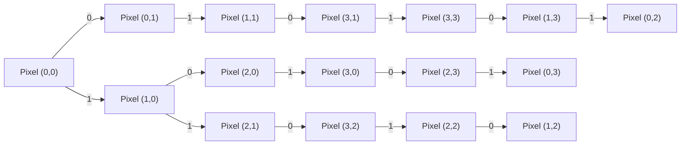

Ainsi, plus la résolution de l'image est élevée, plus la taille de la matrice de pixels est grande et plus l'image est détaillée.

Par la suite, pour stocker des images en couleur, nous pouvons utiliser une matrice de pixels tridimensionnelle où chaque pixel est représenté par une valeur de couleur RVB (rouge, vert, bleu) ou CMJN (cyan, magenta, jaune, noir). 

La valeur de chaque canal de couleur est stockée dans un octet (8 bits), ce qui signifie qu'il y a 256 niveaux de chaque couleur (de 0 à 255).

### Résolution et profondeur de couleur
La résolution et la profondeur de couleur sont deux concepts étroitement liés qui déterminent la qualité visuelle et la taille des données d'une image numérique.
### Résolution

La résolution d'une image est définie par le nombre de pixels qu'elle contient horizontalement et verticalement, généralement noté 
```math
W \times H
```
(par exemple, 800x600, signifiant 800 pixels de large pour 600 pixels de haut).

La résolution a des implications importantes sur la quantité de données requises pour stocker une image. Pour une image fixe avec une profondeur de couleur constante $b$, le nombre total de bits requis pour stocker une image est donné par : $N_\text{bits} = W \times H \times b$, où $W$ est la largeur, $H$ est la hauteur et $b$ est la profondeur de couleur en bits.

La résolution a également un impact sur la bande passante requise pour transmettre des images en temps réel, comme c'est le cas dans les jeux vidéo. Une résolution plus élevée nécessite plus de bande passante pour transmettre les données de l'image.

### Profondeur de couleur

La profondeur de couleur, également appelée bit depth, représente le nombre de bits utilisés pour décrire la couleur d'un pixel, généralement noté $b$. 
Une profondeur de couleur plus élevée permet de représenter un plus grand nombre de couleurs $C = 2^b$, rendant les transitions entre les couleurs plus douces et permettant des images plus réalistes.

Supposons que nous utilisions un espace de couleur RVB. La profondeur de couleur est divisée également entre les composantes rouge, verte et bleue, chacune ayant $b_\text{RGB} = \frac{b}{3}$ bits. Alors, le nombre de valeurs possibles pour chaque composante est $2^{b_\text{RGB}}$. Par conséquent, le nombre total de couleurs différentes pouvant être représentées est : $C = (2^{b_\text{RGB}})^3 = 2^b$.

La profondeur de couleur a également des implications importantes sur la quantité de données requises pour stocker une image, comme mentionné précédemment dans la section sur la résolution.

### Espaces de couleur

Les images bitmap peuvent être stockées en utilisant différents espaces de couleur, qui déterminent la manière dont les informations de couleur sont représentées. Les espaces de couleur les plus courants sont :

-   RVB (Rouge, Vert, Bleu) : Chaque pixel est représenté par trois valeurs de couleur pour les composantes rouge, verte et bleue. Ce format est le plus couramment utilisé dans les jeux vidéo et les applications graphiques.

Dans le cas d'un espace de couleur RVB, la représentation mathématique d'une couleur est donnée par un triplet $(R, G, B)$, où $R$, $G$ et $B$ sont les valeurs des composantes rouge, verte et bleue, respectivement.

### Formats de fichier d'image

Les formats de fichier d'image déterminent la manière dont les données d'image sont organisées et stockées. Plusieurs formats de fichier d'image sont couramment utilisés pour stocker et manipuler des images numériques dans les jeux vidéo et les applications graphiques. Voici quelques-uns des formats les plus courants :

-   BMP (Bitmap) : Un format d'image non compressé développé par Microsoft. Il stocke les données d'image pixel par pixel, sans compression, ce qui peut entraîner des fichiers volumineux.
-   JPEG (Joint Photographic Experts Group) : Un format d'image compressé avec perte qui utilise la compression DCT (Discrete Cosine Transform) pour réduire la taille des fichiers. Il est bien adapté pour stocker des images photographiques avec de nombreux détails et variations de couleur.
-   PNG (Portable Network Graphics) : Un format d'image compressé sans perte qui utilise la compression DEFLATE pour réduire la taille des fichiers. Il est bien adapté pour stocker des images avec des zones de couleur uniforme et des bords nets, comme des graphiques ou des logos.
-   GIF (Graphics Interchange Format) : Un format d'image compressé sans perte développé par CompuServe. Il est limité à une palette de 256 couleurs et est principalement utilisé pour les images animées simples et les graphiques avec des zones de couleur uniforme.
-   TGA (Targa) : Un format d'image développé par Truevision qui prend en charge les images en couleur 8, 16, 24 et 32 bits. Il est souvent utilisé dans les jeux vidéo et les applications de rendu 3D pour stocker des textures.

#### Exemple de schéma Mermaid illustrant les formats de fichier d'image

Voici un schéma Mermaid pour illustrer les différents formats de fichier d'image et leurs principales caractéristiques :

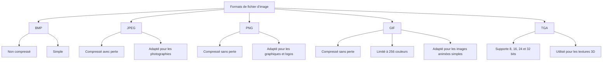
Ce schéma présente les différents formats de fichier d'image (BMP, JPEG, PNG, GIF, TGA) et leurs principales caractéristiques (compression, utilisation, limitation en termes de couleurs, etc.).

[🔝 Retour en haut de page](#table-des-matières)

## Éclairage et ombres

Les techniques d'éclairage et de gestion des ombres sont basées sur des concepts mathématiques et physiques qui permettent de simuler la manière dont la lumière interagit avec les objets et l'environnement.

### Sources de lumière

Les sources de lumière sont des entités qui émettent de la lumière dans une scène. Les principales sources de lumière utilisées dans les jeux vidéo et les graphiques 3D sont :

1.  Lumière directionnelle : Elle représente une source de lumière située à une distance infinie, comme le soleil. Tous les rayons lumineux sont parallèles et ont la même intensité. La lumière directionnelle est souvent utilisée pour simuler la lumière du jour.
    
2.  Lumière ponctuelle : Elle émet de la lumière dans toutes les directions à partir d'un point dans l'espace. L'intensité de la lumière diminue avec la distance à la source de lumière, généralement proportionnelle à l'inverse du carré de la distance.
    
3.  Lumière spot : Elle émet de la lumière dans une direction conique à partir d'un point dans l'espace. La lumière spot est souvent utilisée pour simuler les projecteurs ou les lampes torches.
    

#### Modèles d'éclairage

Les modèles d'éclairage décrivent comment la lumière interagit avec les objets et les surfaces. Voici quelques-uns des modèles d'éclairage les plus couramment utilisés dans les jeux vidéo et les graphiques 3D :

1.  Modèle d'éclairage de Phong : Il est basé sur trois composantes : l'éclairage ambiant, l'éclairage diffus et l'éclairage spéculaire. L'éclairage ambiant est une constante qui simule la lumière indirecte réfléchie par l'environnement. L'éclairage diffus est proportionnel à l'angle entre la normale de la surface et la direction de la lumière, et l'éclairage spéculaire dépend de l'angle entre la direction de la lumière réfléchie et la direction de la caméra.
    
2.  Modèle d'éclairage de Lambert : Il s'agit d'une simplification du modèle d'éclairage de Phong, qui ne prend en compte que l'éclairage ambiant et l'éclairage diffus. Il est moins réaliste mais plus rapide à calculer, ce qui en fait un choix approprié pour les jeux vidéo sur des systèmes à faible puissance de calcul.
    
3.  Modèle d'éclairage de Blinn-Phong : Il s'agit d'une amélioration du modèle d'éclairage de Phong qui utilise une approximation de la direction de la lumière réfléchie pour calculer l'éclairage spéculaire. Le modèle de Blinn-Phong est plus réaliste que le modèle de Phong et est souvent utilisé dans les jeux vidéo modernes.
    

#### Ombres

Les ombres sont des zones où la lumière est bloquée par un objet. Elles ajoutent de la profondeur et du réalisme à une scène. Voici quelques techniques couramment utilisées pour générer des ombres dans les jeux vidéo et les graphiques 3D :
1.  Ombres portées (Shadow mapping) : Cette technique consiste à créer une carte des profondeurs (depth map) à partir de la perspective de la source de lumière. La carte des profondeurs stocke la distance entre la source de lumière et le point le plus proche qui la bloque. Lors du rendu de la scène, on compare la distance entre la source de lumière et le point courant avec la distance stockée dans la carte des profondeurs. Si la distance courante est supérieure à la distance stockée, le point est dans l'ombre.
    
2.  Ombres volumétriques (Volumetric shadows) : Cette technique simule les ombres en calculant l'atténuation de la lumière lorsqu'elle traverse des objets semi-transparents, comme la fumée ou la brume. Les ombres volumétriques donnent un aspect réaliste aux scènes où la lumière interagit avec des particules en suspension dans l'air.
    
3.  Ombres douces (Soft shadows) : Les ombres douces sont des ombres qui présentent un flou progressif en s'éloignant de l'objet qui les projette. Cette technique consiste à simuler plusieurs sources de lumière proches les unes des autres, ou à utiliser des techniques de filtrage pour adoucir les bords des ombres portées.
    
4.  Ray tracing : Le ray tracing est une technique de rendu avancée qui simule le comportement de la lumière en traçant des rayons depuis la caméra jusqu'à la source de lumière, en prenant en compte les réflexions et les réfractions. Le ray tracing permet de générer des ombres, des reflets et des effets de lumière globale très réalistes, mais il est également très coûteux en termes de temps de calcul. Le ray tracing est de plus en plus utilisé dans les jeux vidéo grâce à l'évolution des cartes graphiques et des algorithmes de rendu.


[🔝 Retour en haut de page](#table-des-matières)

## Texture et mappage UV

#### Texture et coordonnées de texture

Les textures sont des images 2D appliquées sur des objets 3D pour donner l'illusion de détails tels que les couleurs, les motifs ou les reliefs. 
Elles peuvent être utilisées pour représenter la couleur de base d'un objet, sa brillance, sa rugosité, sa transparence, etc. 

Les coordonnées de texture, également appelées coordonnées UV, déterminent la manière dont une texture est mappée sur un objet 3D.

Pour appliquer une texture à un objet 3D, on attribue à chaque sommet de l'objet un ensemble de coordonnées UV, qui correspondent aux coordonnées (u, v) dans l'image de texture. Les coordonnées UV varient généralement de 0 à 1, où (0, 0) correspond au coin inférieur gauche de l'image de texture et (1, 1) au coin supérieur droit.

#### Mappage UV

Le mappage UV est le processus qui consiste à déterminer les coordonnées UV pour chaque sommet d'un objet 3D. Ce processus est souvent réalisé manuellement par des artistes 3D à l'aide de logiciels spécialisés, mais il existe également des algorithmes de mappage UV automatiques.

Il existe plusieurs techniques de mappage UV, dont certaines sont :

1.  Mappage planaire : Cette technique projette la texture sur l'objet 3D à partir d'un plan. Elle fonctionne bien pour les objets qui ont une forme relativement plane, mais peut provoquer des distorsions et des étirements sur les objets plus complexes.
    
2.  Mappage cylindrique : Cette technique enroule la texture autour de l'objet 3D comme si elle était imprimée sur un cylindre. Elle fonctionne bien pour les objets ayant une forme cylindrique, mais peut également provoquer des distorsions sur les objets plus complexes.
    
3.  Mappage sphérique : Cette technique projette la texture sur l'objet 3D à partir d'une sphère. Elle fonctionne bien pour les objets ayant une forme sphérique, mais peut provoquer des distorsions aux pôles de la sphère.
    
4.  Mappage par morceaux (UV unwrapping) : Cette technique consiste à découper l'objet 3D en morceaux, puis à les déplier en 2D pour créer une représentation plane de l'objet. Cette technique permet de minimiser les distorsions, mais nécessite généralement un travail manuel minutieux pour obtenir de bons résultats.

[🔝 Retour en haut de page](#table-des-matières)

### Animation
L'animation en infographie consiste à créer l'illusion de mouvement ou de changement d'un objet ou d'une scène 3D au fil du temps. 
Les plus courantes étant l'animation par squelette, l'animation de forme et la cinématique inverse.

### Animation par squelette

L'animation par squelette (Rigging), également appelée animation par armature, consiste à définir une structure osseuse (ou armature) pour un objet 3D et à manipuler cette structure pour créer des mouvements.

 Chaque os de l'armature est associé à une partie de l'objet 3D et déforme cette partie lorsqu'il est déplacé ou orienté. L'animation par squelette est largement utilisée pour animer des personnages et des créatures dans les jeux vidéo et les films d'animation.

Une armature est un ensemble de noeuds (ou articulations) reliés par des os. Les noeuds ont des positions 3D et des orientations, généralement représentées par des matrices de transformation 4x4. Pour déterminer la position et l'orientation d'un noeud, on utilise la relation suivante :

$T_\text{parent} \times T_\text{local} = T_\text{global}$

où $T_\text{parent}$ est la matrice de transformation globale du noeud parent, $T_\text{local}$ est la matrice de transformation locale du noeud actuel, et $T_\text{global}$ est la matrice de transformation globale du noeud actuel.

L'animation d'une armature consiste à modifier les matrices de transformation locale des noeuds au fil du temps, créant ainsi des mouvements.

### Animation de forme

L'animation de forme, également appelée morphing ou interpolation de formes, consiste à interpoler entre différentes formes d'un objet 3D pour créer des animations. Cette technique est souvent utilisée pour animer des objets dont la géométrie change de manière complexe, comme les visages ou les vêtements.

L'animation de forme implique généralement l'interpolation linéaire entre les positions des sommets des différentes formes. Pour interpoler entre deux formes $A$ et $B$ à un facteur d'interpolation $t$, où $0 \le t \le 1$, on utilise la formule suivante :

$P_\text{interpolated} = (1 - t) \times P_\text{A} + t \times P_\text{B}$

où $P_\text{interpolated}$ est la position interpolée du sommet, et $P_\text{A}$ et $P_\text{B}$ sont les positions du sommet dans les formes $A$ et $B$, respectivement.

### Cinématique inverse

La cinématique inverse est une technique d'animation utilisée pour calculer les angles des articulations d'une armature en fonction de la position désirée d'un effecteur (généralement la main ou le pied d'un personnage). Cette technique est particulièrement utile pour les animations interactives, comme lorsqu'un personnage saisit un objet ou marche sur un terrain irrégulier.

La cinématique inverse implique généralement la résolution d'un système d'équations non linéaires décrivant les positions et les orientations des noeuds de l'armature

[🔝 Retour en haut de page](#table-des-matières)

## Physique des jeux

La physique des jeux est un élément clé pour créer des environnements interactifs et réalistes dans les jeux vidéo. Elle comprend la simulation de mouvements, de forces et de collisions entre objets dans un monde virtuel. Les principales composantes de la physique des jeux incluent la simulation physique, la détection de collision et la résolution de collision.

### Simulation physique

La simulation physique implique le calcul des mouvements et des forces qui agissent sur les objets dans un monde virtuel. Les mouvements sont généralement basés sur les lois fondamentales de la mécanique classique, comme la loi de Newton : $F = m \times a$ où $F$ est la force, $m$ est la masse de l'objet et $a$ est son accélération.

Les forces peuvent inclure la gravité, les forces de contact, les forces de frottement et d'autres forces externes. L'accélération d'un objet est calculée en fonction de la somme des forces qui agissent sur lui : $a = \frac{\sum F}{m}$ Ensuite, la position et la vitesse de l'objet sont mises à jour en fonction de son accélération :
```math
v_{t+1} = v_t + a \times \Delta t
```
```math
p_{t+1} = p_t + v_{t+1} \times \Delta t
```
où $v_t$ et $p_t$ sont la vitesse et la position de l'objet à l'instant $t$, et $\Delta t$ est le pas de temps de la simulation.

### Collision

La collision est un phénomène physique qui se produit lorsqu'un objet entre en contact avec un autre objet. Les collisions sont cruciales pour créer des interactions réalistes entre objets dans un jeu vidéo. La détection de collision et la résolution de collision sont deux étapes clés pour gérer les collisions dans la physique des jeux.

### Détection de collision

La détection de collision est le processus par lequel on détermine si deux objets se touchent ou se croisent. Il existe de nombreuses techniques pour détecter les collisions, notamment les tests de boîtes englobantes (AABB), les tests de sphères englobantes et les tests de séparation d'axes (SAT). Chaque technique a ses avantages et ses inconvénients en termes de précision et de performances.

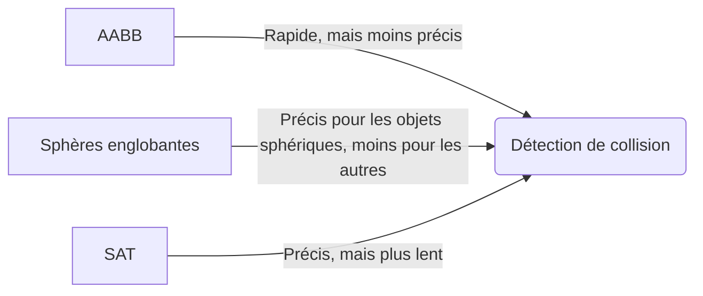

### Résolution de collision

La résolution de collision est le processus par lequel on modifie les positions, les vitesses et les forces des objets en collision pour éviter qu'ils ne se chevauchent ou ne traversent les autres objets. 

La résolution de collision peut être basée sur des principes de mécanique classique, comme la conservation de l'énergie cinétique et de la quantité de mouvement, ou sur des techniques heuristiques pour simplifier les calculs et améliorer les performances.

La résolution de collision implique généralement l'application d'une force d'impulsion aux objets en collision pour les séparer :

```math
J = \frac{-(1 + e) \times (v_{A_t} - v_{B_t}) \cdot n}{\frac{1}{m_A} + \frac{1}{m_B}}
```

où $J$ est l'impulsion, $e$ est le coefficient de restitution (élasticité), $v_{A_t}$ et $v_{B_t}$ sont les vitesses des objets A et B avant la collision, $m_A$ et $m_B$ sont les masses des objets, et $n$ est le vecteur normal à la surface de contact.

Ensuite, les vitesses des objets après la collision sont mises à jour en fonction de l'impulsion appliquée : $v_{A_{t+1}} = v_{A_t} + \frac{J}{m_A} \times n$ $v_{B_{t+1}} = v_{B_t} - \frac{J}{m_B} \times n$

La position des objets peut également être corrigée pour éviter les chevauchements en déplaçant les objets en fonction de la profondeur de pénétration et d'un facteur de correction :
```math
p_{A_{t+1}} = p_{A_t} - \frac{1}{m_A} \times \frac{m_A + m_B}{m_A \times m_B} \times P \times n
```
```math
p_{B_{t+1}} = p_{B_t} + \frac{1}{m_B} \times \frac{m_A + m_B}{m_A \times m_B} \times P \times n
```
où $P$ est la profondeur de pénétration et $n$ est le vecteur normal à la surface de contact.

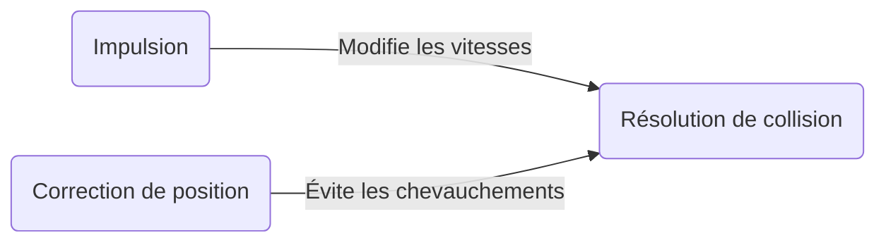


[🔝 Retour en haut de page](#table-des-matières)

## Intelligence artificielle
Les jeux vidéo utilisent souvent l'intelligence artificielle (IA) pour contrôler les personnages non joueurs (PNJ). Les comportements de base des PNJ peuvent être modélisés à l'aide de machines à états finis (FSM) ou d'arbres de comportement. Les FSM représentent l'état actuel d'un PNJ et les transitions entre les différents états en fonction des conditions du jeu. Les arbres de comportement sont des structures hiérarchiques qui déterminent le comportement d'un PNJ en fonction de l'évaluation des conditions à chaque niveau de l'arbre.

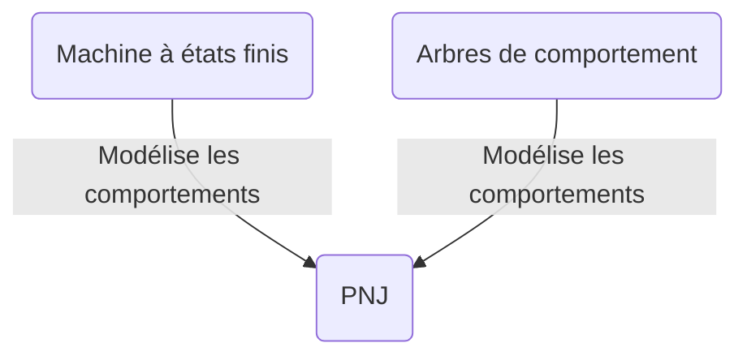

### Navigation

La navigation des PNJ dans un environnement de jeu nécessite la planification de chemins pour éviter les obstacles et atteindre les objectifs. Les algorithmes de planification de chemins tels que l'algorithme A* sont couramment utilisés pour déterminer le chemin optimal entre deux points, en tenant compte des contraintes de l'environnement.

L'algorithme A* utilise une fonction d'évaluation $f(n) = g(n) + h(n)$ pour estimer le coût total du chemin passant par le nœud $n$. La fonction $g(n)$ représente le coût réel pour atteindre le nœud $n$ depuis le nœud de départ, et $h(n)$ est une heuristique qui estime le coût restant pour atteindre le nœud d'arrivée depuis le nœud $n$. L'algorithme A* explore les nœuds ayant le coût total le plus faible en premier, garantissant la découverte du chemin optimal.

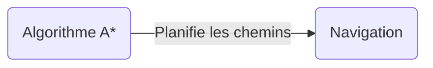

### Apprentissage automatique

L'apprentissage automatique peut également être utilisé pour améliorer l'IA des jeux vidéo. Les réseaux de neurones artificiels (ANN) sont une méthode d'apprentissage automatique populaire pour modéliser les comportements complexes des PNJ et des systèmes de jeu. Les ANN sont composés de nœuds (neurones) organisés en couches, et sont capables d'apprendre des modèles à partir de données d'entrée en ajustant les poids des connexions entre les neurones.

Les algorithmes d'apprentissage par renforcement, tels que Q-learning et Deep Q-Network (DQN), sont particulièrement adaptés aux jeux vidéo, car ils permettent aux agents d'apprendre des politiques optimales en interagissant avec l'environnement de jeu.


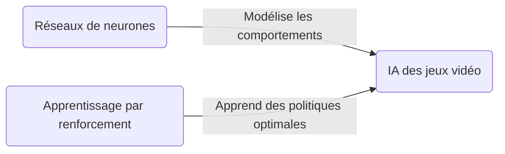

[🔝 Retour en haut de page](#table-des-matières)


## Réseau et multijoueur
XXX
### Modèles de réseau

Les jeux multijoueurs en réseau reposent sur différentes architectures pour synchroniser les données entre les joueurs. Les deux modèles principaux sont le modèle client-serveur et le modèle peer-to-peer (P2P).

-   **Client-serveur** : Dans ce modèle, un serveur central gère l'état du jeu et communique avec les clients (les joueurs). Les clients envoient des informations sur leurs actions au serveur, qui met à jour l'état du jeu et envoie des mises à jour aux clients. Le serveur est responsable de la synchronisation des données et de la gestion des conflits entre les clients.

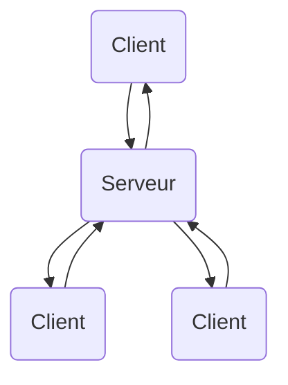

-   **Peer-to-peer** : Dans ce modèle, les joueurs se connectent directement les uns aux autres sans passer par un serveur central. Chaque joueur est responsable de la synchronisation de son propre état de jeu avec les autres joueurs. Ce modèle peut être plus efficace en termes de bande passante et de latence, mais il peut également être plus complexe à mettre en œuvre, en particulier pour les jeux avec un grand nombre de joueurs.

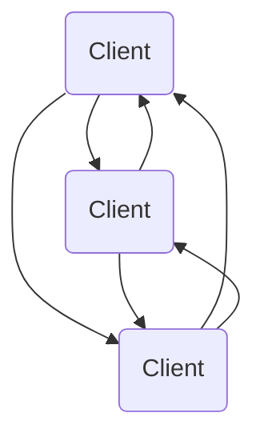

### Protocoles de communication

Les jeux en réseau utilisent différents protocoles de communication pour échanger des données entre les joueurs. Les deux protocoles les plus courants sont le protocole de datagramme utilisateur (UDP) et le protocole de contrôle de transmission (TCP).

-   **UDP** : L'UDP est un protocole de communication sans connexion et sans garantie de livraison. Il est généralement utilisé dans les jeux en temps réel en raison de sa faible latence. Cependant, les paquets de données peuvent être perdus ou arriver dans le désordre, ce qui nécessite une gestion supplémentaire de la part du programme de jeu.
    
-   **TCP** : Le TCP est un protocole de communication orienté connexion avec garantie de livraison. Il garantit que les paquets de données sont livrés dans l'ordre et sans erreurs. Le TCP est généralement utilisé pour les communications non critiques pour le temps, telles que le chat en jeu ou la mise à jour des classements.
    

### Programmation de jeu multijoueur

La programmation de jeu multijoueur implique la gestion de la synchronisation des données entre les joueurs, la détection et la résolution des conflits, et la gestion des erreurs de réseau. Les développeurs de jeux doivent également prendre en compte des problèmes tels que la latence, la bande passante et la sécurité.

Pour gérer ces problèmes, les développeurs peuvent utiliser des bibliothèques de réseau spécifiques au jeu ou des moteurs de jeu intégrant des fonctionnalités réseau. Les développeurs doivent également implémenter des mécanismes pour gérer les déconnexions de joueurs, les tricheurs et les attaques par déni de service.

[🔝 Retour en haut de page](#table-des-matières)

## Techniques avancées
XX
### Physique des fluides

La simulation de fluides dans les jeux vidéo est une technique avancée qui permet de reproduire le comportement des liquides et des gaz. Les fluides sont généralement simulés à l'aide d'équations aux dérivées partielles, telles que les équations de Navier-Stokes. Les méthodes de résolution numérique, telles que la méthode des différences finies ou la méthode des éléments finis, sont utilisées pour résoudre ces équations et générer des animations réalistes de fluides.

### Écrans multiples et fenêtrage

Les jeux modernes offrent souvent la possibilité de jouer sur plusieurs écrans ou dans des fenêtres redimensionnables. Cette fonctionnalité nécessite une gestion avancée du rendu et de la résolution d'affichage, ainsi que la prise en charge de plusieurs moniteurs et configurations de fenêtres. Les développeurs de jeux doivent tenir compte de la synchronisation entre les écrans et des performances graphiques lors de l'implémentation de ces fonctionnalités.

### Intelligence artificielle avancée

L'intelligence artificielle (IA) avancée dans les jeux vidéo englobe des techniques telles que l'apprentissage automatique, la planification, la prise de décision et le traitement du langage naturel. Ces techniques permettent de créer des personnages non joueurs (PNJ) plus réalistes et convaincants, ainsi que des systèmes de jeu dynamiques et adaptatifs.

Les développeurs de jeux peuvent utiliser des bibliothèques et des frameworks d'IA spécifiques pour implémenter ces fonctionnalités, comme TensorFlow, PyTorch, et le projet OpenAI. Ces outils permettent d'entraîner des modèles d'apprentissage profond pour la reconnaissance d'image, la génération de texte, et d'autres tâches complexes d'IA.

### Rendu avancé

Le rendu avancé dans les jeux vidéo englobe un large éventail de techniques pour améliorer la qualité visuelle et la performance du rendu. Parmi ces techniques, on trouve :

-   **Rendu basé sur la physique (PBR)** : Le PBR est une approche de rendu qui simule la façon dont la lumière interagit avec les matériaux de manière réaliste. Il utilise des modèles d'éclairage et de réflexion basés sur des mesures physiques pour générer des images plus fidèles à la réalité.
-   **Occlusion ambiante** : L'occlusion ambiante est une technique de rendu qui simule l'obscurcissement de la lumière ambiante dans les coins et les recoins d'une scène. Cette technique ajoute de la profondeur et du réalisme aux scènes en renforçant les détails géométriques et les ombres.
-   **Tesselation** : La tesselation est une technique de rendu qui subdivise les maillages en polygones plus petits pour améliorer la qualité des détails à proximité du spectateur. Cette technique peut être utilisée en combinaison avec le displacement mapping pour créer des surfaces extrêmement détaillées sans sacrifier les performances.
-  **Ray tracing** : Le ray tracing est une technique de rendu qui simule la trajectoire des rayons de lumière pour générer des images réalistes avec des réflexions, des réfractions et des ombres précises. Bien que cette technique soit très coûteuse en termes de performances, l'émergence de matériel spécialisé, comme les GPU compatibles avec le ray tracing en temps réel, a rendu cette technologie plus accessible pour les jeux vidéo.

-   **Global illumination** : L'illumination globale est une technique de rendu qui simule la façon dont la lumière se propage et rebondit dans une scène pour produire un éclairage indirect réaliste. Il existe plusieurs méthodes pour calculer l'illumination globale, dont certaines sont plus adaptées aux jeux vidéo, comme les lightmaps précalculées, les approches basées sur les voxels et les approches basées sur les sondes de lumière.

[🔝 Retour en haut de page](#table-des-matières)


## Rendu graphique

#### Pipeline de rendu

Le pipeline de rendu est un processus séquentiel qui convertit les objets 3D et les textures du jeu en images 2D affichées à l'écran. Le pipeline de rendu comprend plusieurs étapes, notamment la transformation des objets 3D en coordonnées du monde, la projection des objets sur une image 2D, le calcul des ombres et de l'éclairage, et le rendu des textures et des effets spéciaux.

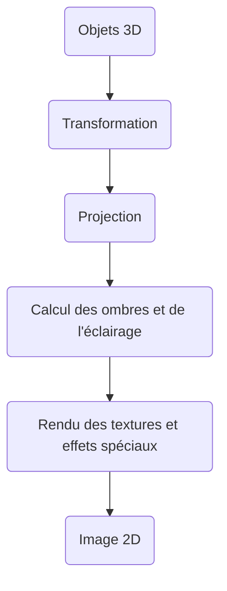
### 11.1 Culling et occlusion

Le culling et l'occlusion sont des techniques utilisées pour optimiser le rendu graphique en éliminant les objets ou les parties d'objets qui ne sont pas visibles à l'écran. Le culling se concentre sur l'élimination des objets entiers qui sont en dehors du champ de vision de la caméra, tandis que l'occlusion élimine les parties d'objets qui sont cachées derrière d'autres objets.

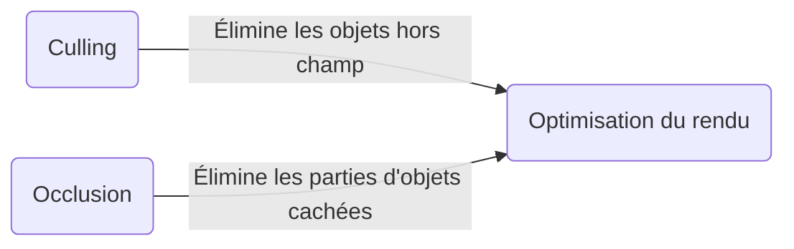

### Shaders

Les shaders sont des programmes qui sont exécutés sur les unités de traitement graphique (GPU) pour déterminer les caractéristiques visuelles des objets affichés à l'écran. Les shaders permettent de créer des effets spéciaux, tels que les réflexions, les ombres et les animations de texture. Ils sont généralement écrits dans des langages de programmation spécifiques au GPU, tels que GLSL (OpenGL Shading Language) ou HLSL (High-Level Shading Language).

Il existe différents types de shaders, notamment les vertex shaders, les geometry shaders et les fragment shaders. Les vertex shaders sont appliqués aux sommets des objets 3D, les geometry shaders sont utilisés pour créer ou modifier la géométrie des objets, et les fragment shaders déterminent les couleurs et les textures des pixels affichés à l'écran.

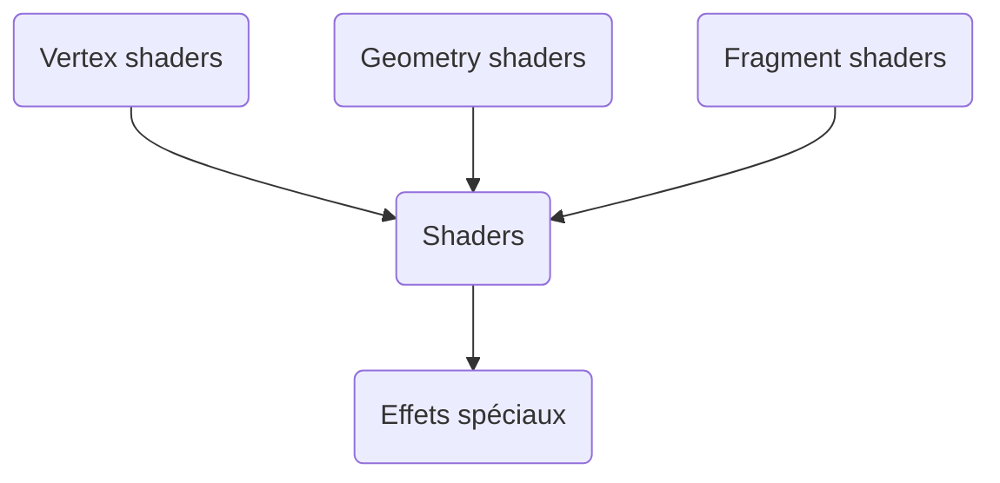

[🔝 Retour en haut de page](#table-des-matières)


[^1]: Des modifications peuvent survenir. <br>[Tanguy Chénier](https://www.linkedin.com/in/tanguy-chenier/).
